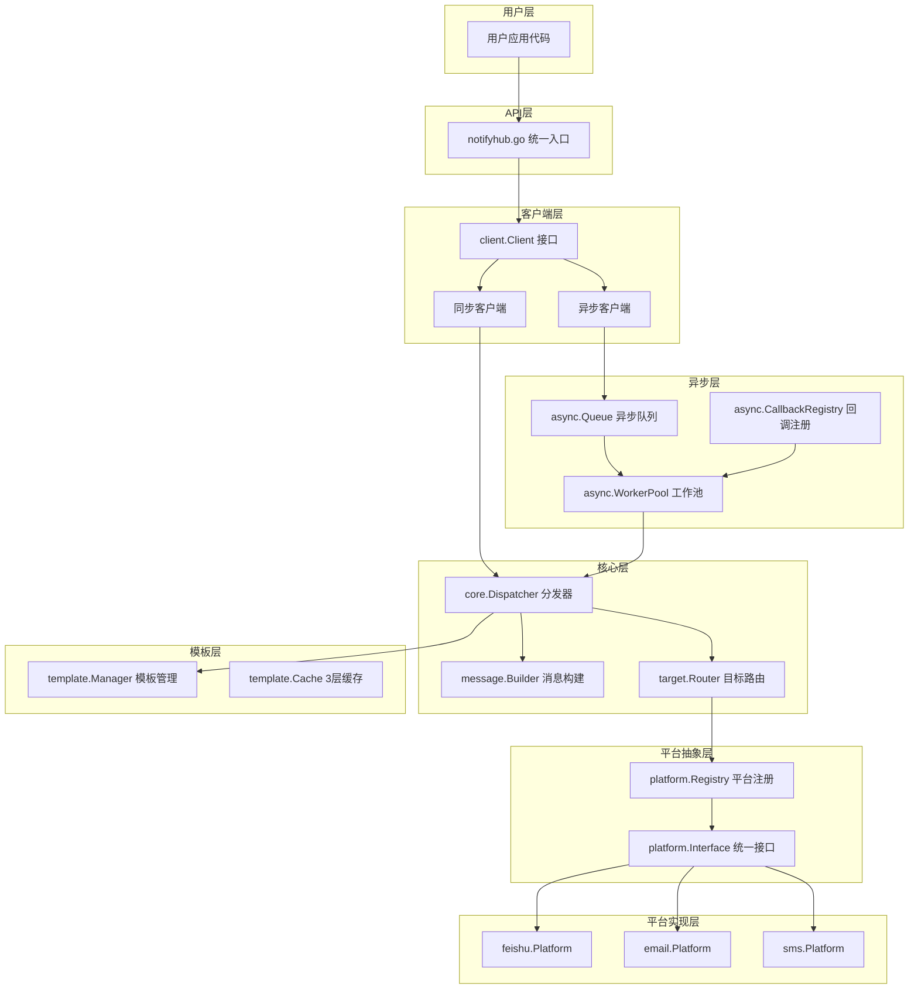

# 设计文档

## 概述

NotifyHub 架构重构设计基于对现有系统的深入分析，旨在解决当前架构中的关键问题：621行的巨型工厂文件、伪异步实现、重复类型定义、复杂的6层调用链以及不一致的配置模式。

重构后的架构将采用8层清洁设计，实现真正的异步处理、统一的类型系统、简化的3层调用链，以及基于插件的可扩展平台系统。

## 架构

### 整体架构图



### 新架构层次设计

基于分析文档的建议，采用8层架构设计：

1. **用户层** - 应用代码调用
2. **API网关层** - 统一入口点 (notifyhub.go)
3. **客户端接口层** - 同步/异步统一接口
4. **模板管理层** - 多引擎模板支持
5. **路由引擎层** - 智能平台路由
6. **队列系统层** - 真正异步处理
7. **平台抽象层** - 统一平台接口
8. **外部服务层** - 具体平台实现

### 简化调用链路

**当前问题链路（6层）：**

```
用户代码 → clientAdapter → Hub → Manager → Sender → Platform
```

**新设计链路（3层）：**

```
用户代码 → Client → Platform
```

## 组件和接口

### 1. 统一客户端接口

```go
// pkg/notifyhub/client/client.go
type Client interface {
    // 同步接口
    Send(ctx context.Context, msg *message.Message) (*receipt.Receipt, error)
    SendBatch(ctx context.Context, msgs []*message.Message) ([]*receipt.Receipt, error)

    // 异步接口（真正异步 + 回调）
    SendAsync(ctx context.Context, msg *message.Message, opts ...async.Option) (async.Handle, error)
    SendAsyncBatch(ctx context.Context, msgs []*message.Message, opts ...async.Option) (async.BatchHandle, error)

    // 管理接口
    Health(ctx context.Context) (*health.Status, error)
    Close() error
}
```

### 2. 统一平台接口

```go
// pkg/notifyhub/platform/interface.go
type Platform interface {
    Name() string
    Send(ctx context.Context, msg *message.Message, targets []target.Target) ([]*receipt.Result, error)
    Validate(target target.Target) error
    Capabilities() Capabilities
    Health(ctx context.Context) error
    Close() error
}
```

### 3. 异步处理系统

```go
// pkg/notifyhub/async/handle.go
type Handle interface {
    MessageID() string
    Wait(ctx context.Context) (*receipt.Receipt, error)
    Status() Status
    Cancel() error
    Result() <-chan Result
}

// pkg/notifyhub/async/options.go
type Option func(*Config)

type Config struct {
    OnResult    func(*receipt.Receipt)
    OnError     func(*message.Message, error)
    OnProgress  func(completed, total int)
    OnComplete  func(*Summary)
    Priority    message.Priority
    Timeout     time.Duration
}
```

### 4. 模板管理系统

```go
// pkg/notifyhub/template/manager.go
type Manager interface {
    Render(templateID string, data map[string]interface{}) (string, error)
    RegisterTemplate(id, content string, engine Engine) error
    LoadFromFile(path string) error
    HotReload() error
}

type Engine int
const (
    GoTemplate Engine = iota
    Mustache
    Handlebars
)

// 3层缓存架构
type Cache interface {
    Get(key string) (Template, bool)
    Set(key string, template Template, ttl time.Duration)
    Invalidate(key string)
}
```

### 5. 配置系统统一化

```go
// pkg/notifyhub/config/options.go
type Option func(*Config) error

// 统一配置模式
func WithPlatform(name string, config interface{}) Option
func WithFeishu(config FeishuConfig) Option
func WithEmail(config EmailConfig) Option
func WithAsyncWorkers(count int) Option
func WithTemplateEngine(engine template.Engine) Option
```

## 数据模型

### 统一消息类型

基于分析文档建议，消除3个重复的Message定义，统一为：

```go
// pkg/notifyhub/message/message.go
type Message struct {
    ID           string                 `json:"id"`
    Title        string                 `json:"title"`
    Body         string                 `json:"body"`
    Format       Format                 `json:"format"`
    Priority     Priority               `json:"priority"`
    Targets      []target.Target        `json:"targets"`
    Metadata     map[string]interface{} `json:"metadata,omitempty"`
    Variables    map[string]interface{} `json:"variables,omitempty"`
    PlatformData map[string]interface{} `json:"platform_data,omitempty"`
    CreatedAt    time.Time             `json:"created_at"`
    ScheduledAt  *time.Time            `json:"scheduled_at,omitempty"`
}
```

### 统一目标类型

```go
// pkg/notifyhub/target/target.go
type Target struct {
    Type     Type                `json:"type"`
    Value    string              `json:"value"`
    Platform string              `json:"platform"`
    Metadata map[string]string   `json:"metadata,omitempty"`
}

type Type int
const (
    TypeEmail Type = iota + 1
    TypePhone
    TypeUser
    TypeGroup
    TypeChannel
    TypeWebhook
)
```

### 平台能力描述

```go
// pkg/notifyhub/platform/capabilities.go
type Capabilities struct {
    Name                 string   `json:"name"`
    SupportedTargetTypes []string `json:"supported_target_types"`
    SupportedFormats     []string `json:"supported_formats"`
    MaxMessageSize       int      `json:"max_message_size"`
    SupportsScheduling   bool     `json:"supports_scheduling"`
    SupportsAttachments  bool     `json:"supports_attachments"`
    SupportsMentions     bool     `json:"supports_mentions"`
    SupportsRichContent  bool     `json:"supports_rich_content"`
    RequiredSettings     []string `json:"required_settings"`
}
```

## 错误处理

### 统一错误类型系统

```go
// pkg/notifyhub/errors/errors.go
type NotifyError struct {
    Code      Code                `json:"code"`
    Message   string              `json:"message"`
    Platform  string              `json:"platform,omitempty"`
    Target    string              `json:"target,omitempty"`
    Metadata  map[string]string   `json:"metadata,omitempty"`
    Cause     error               `json:"-"`
}

type Code string
const (
    CodeInvalidConfig      Code = "INVALID_CONFIG"
    CodeUnsupportedTarget  Code = "UNSUPPORTED_TARGET"
    CodeUnsupportedFormat  Code = "UNSUPPORTED_FORMAT"
    CodeMessageTooLarge    Code = "MESSAGE_TOO_LARGE"
    CodeRateLimited        Code = "RATE_LIMITED"
    CodePlatformDown       Code = "PLATFORM_DOWN"
    CodeInvalidCredentials Code = "INVALID_CREDENTIALS"
    CodeNetworkError       Code = "NETWORK_ERROR"
    CodeTimeout            Code = "TIMEOUT"
)
```

### 重试策略

```go
// pkg/notifyhub/errors/retry.go
type RetryPolicy struct {
    MaxRetries      int           `json:"max_retries"`
    InitialInterval time.Duration `json:"initial_interval"`
    MaxInterval     time.Duration `json:"max_interval"`
    Multiplier      float64       `json:"multiplier"`
    MaxElapsedTime  time.Duration `json:"max_elapsed_time"`
    Jitter          bool          `json:"jitter"`
}
```

## 测试策略

### 1. 单元测试策略

- **包级别隔离测试**: 每个包可独立测试
- **接口模拟**: 使用接口进行依赖注入和模拟
- **覆盖率目标**: 90%+ 代码覆盖率

### 2. 集成测试策略

- **端到端流程测试**: 从客户端到平台的完整流程
- **异步回调测试**: 验证异步操作和回调机制
- **错误场景测试**: 网络故障、超时、限流等场景

### 3. 性能测试策略

- **基准测试**: 对比重构前后的性能指标
- **并发测试**: 验证异步处理能力
- **内存使用测试**: 确认减少40%内存分配的目标

### 4. 向后兼容性测试

- **API兼容性验证**: 确保现有用户代码可正常迁移
- **功能等价性测试**: 验证重构后功能与原系统一致

## 插件系统设计

### 动态平台加载

```go
// pkg/notifyhub/platform/loader.go
type Loader interface {
    LoadPlugin(path string) (Platform, error)
    RegisterPlatform(name string, factory PlatformFactory) error
    GetPlatform(name string) (Platform, bool)
    ListPlatforms() []string
}

// 支持 .so 文件动态加载
type PlatformFactory func(config map[string]interface{}) (Platform, error)
```

### 热插拔支持

- 运行时平台注册/注销
- 配置热更新
- 无服务中断的平台切换

## 迁移策略

### 阶段1：基础重构（1-2周）

- 删除冗余代码（types.go, builders.go, clientAdapter）
- 统一类型定义
- 简化调用链路

### 阶段2：异步系统（2-3周）

- 实现真正异步队列
- 建立回调机制
- 工作池管理

### 阶段3：模板系统（1-2周）

- 多引擎模板支持
- 3层缓存实现
- 热重载机制

### 阶段4：测试和优化（1周）

- 全面测试覆盖
- 性能基准验证
- 向后兼容确认

### 性能目标验证

根据分析文档的预测，重构完成后应实现：

- 30% 性能提升（通过简化调用链路）
- 40% 代码减少（消除冗余）
- 40% 内存开销降低（统一类型）
- 50% 开发效率提升（清晰架构）

## 设计决策理由

### 1. 为什么采用8层架构？

基于分析文档的建议，8层架构提供了清晰的职责分离，每层都有明确的单一职责。

### 2. 为什么删除适配器层？

分析发现 `clientAdapter` 只是简单转发，没有业务价值，删除可减少性能开销。

### 3. 为什么统一类型定义？

当前有3个重复的Message定义，统一后减少类型转换和内存分配。

### 4. 为什么重新设计异步系统？

当前的异步实现是伪异步，新设计提供真正的队列和完整回调支持。

### 5. 为什么选择插件架构？

支持运行时平台扩展，提高系统可扩展性，符合开闭原则。

这个设计基于详细的现状分析，确保解决所有识别的架构问题，同时为未来扩展提供坚实基础。
