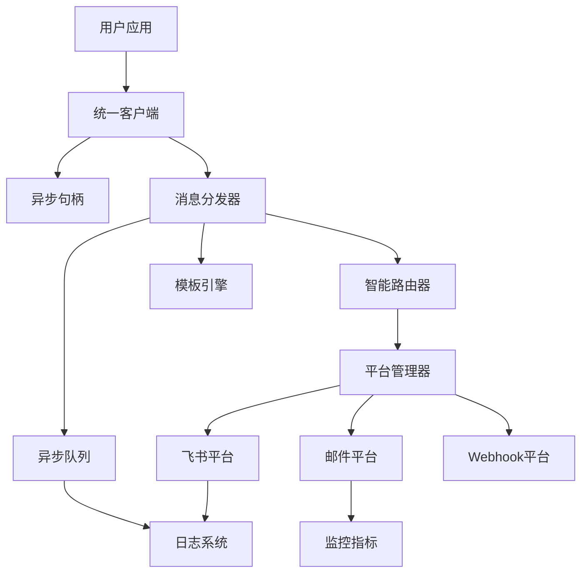

# NotifyHub 架构重构设计文档

## 概述

本文档描述了 NotifyHub 的全面架构重构设计，旨在解决当前实现中的设计问题，包括巨型文件、职责混乱、伪异步实现和复杂调用链。新设计基于模块化、单一职责原则和清晰的抽象层次，提供一个干净、高性能且易于维护的通知系统。

### 设计目标

1. **简化调用链**：从复杂的 6 层调用减少到清晰的 3 层架构
2. **职责分离**：每个模块专注于单一职责，消除巨型文件
3. **真正异步**：实现基于队列的异步处理和回调机制
4. **统一接口**：标准化平台接口和配置模式
5. **性能优化**：目标实现 30% 的性能提升

### 当前问题分析

基于六维度深度分析，当前架构存在以下关键问题：

#### 1. 调用链路复杂性（6层 → 3层）

**当前问题**：

```
用户代码 → notifyhub.New → core.NewHub → HubImpl → Dispatcher → PlatformManager → Platform
```

**解决方案**：

```
用户代码 → client.New → Client → Dispatcher → Platform
```

#### 2. 巨型文件和职责混杂

**当前问题**：

- `feishu/sender.go`: 669行，包含认证、消息构建、发送、配置等多种职责
- `hub_factory.go`: 622行，包含工厂、配置、适配器、验证等功能

**解决方案**：

- 按SRP原则拆分为多个专门文件
- 每个文件不超过300行，职责单一明确

#### 3. 全局状态依赖

**当前问题**：

- `globalPlatformRegistry` 影响多实例使用
- 全局状态导致测试困难和并发问题

**解决方案**：

- 实例级平台注册表
- 依赖注入替代全局状态
- 完全的实例隔离

#### 4. 配置二元化问题

**当前问题**：

```go
// 方式1: 强类型配置
feishu.WithFeishu("webhook", feishu.WithFeishuSecret("secret"))

// 方式2: map配置
WithPlatform("feishu", map[string]interface{}{
    "webhook": "url",
    "secret": "secret",
})
```

**解决方案**：

- 统一使用函数式选项模式
- 强类型配置结构
- 废弃map配置方式

#### 5. 伪异步实现

**当前问题**：

- `SendAsync` 没有真正的队列支持
- 缺乏回调机制
- 无法处理批量异步操作

**解决方案**：

- 基于队列的真异步处理
- 完整的回调支持
- 异步句柄管理

## 架构

### 整体架构图



### 分层架构

#### 第1层：客户端层 (Client Layer)

- **职责**：提供统一的用户接口，处理参数验证和配置管理
- **组件**：`Client`, `ConfigManager`, `AsyncHandle`

#### 第2层：核心层 (Core Layer)

- **职责**：消息分发、路由决策、异步处理
- **组件**：`Dispatcher`, `Router`, `Queue`

#### 第3层：平台层 (Platform Layer)

- **职责**：具体平台的消息发送实现
- **组件**：各种平台适配器 (`Feishu`, `Email`, `Webhook`)

### 简化调用链路

**当前问题链路（复杂）：**

```
用户代码 → core.NewHub → HubImpl → Dispatcher → PlatformManager → Platform
```

**新设计链路（简化）：**

```
用户代码 → client.New → Client → Dispatcher → Platform
```

**关键改进：**

- 移除 `core.NewHub` 入口，统一使用 `client.New`
- 移除全局注册表，使用依赖注入
- 直接调用平台，减少中间层

## 组件和接口

### 包结构设计

```
pkg/
├── notifyhub/              # 主包入口
│   ├── client.go           # 统一客户端接口
│   ├── config.go           # 配置管理
│   └── factory.go          # 客户端工厂
├── core/                   # 核心处理逻辑
│   ├── dispatcher.go       # 消息分发器
│   ├── router.go           # 智能路由器
│   └── manager.go          # 平台管理器
├── async/                  # 异步处理
│   ├── queue.go            # 队列接口
│   ├── handle.go           # 异步句柄
│   ├── callback.go         # 回调管理
│   └── worker.go           # 工作器池
├── platform/               # 平台抽象
│   ├── interface.go        # 平台接口定义
│   ├── registry.go         # 平台注册表
│   └── adapter.go          # 通用适配器
├── platforms/              # 具体平台实现
│   ├── feishu/
│   │   ├── platform.go     # 平台实现
│   │   ├── message.go      # 消息构建
│   │   ├── auth.go         # 认证处理
│   │   └── config.go       # 配置结构
│   ├── email/
│   └── webhook/
├── message/                # 消息抽象
│   ├── message.go          # 消息结构
│   ├── builder.go          # 消息构建器
│   └── validator.go        # 消息验证
├── target/                 # 目标抽象
│   ├── target.go           # 目标结构
│   ├── resolver.go         # 目标解析
│   └── router.go           # 目标路由
├── template/               # 模板引擎
│   ├── engine.go           # 模板引擎接口
│   ├── cache.go            # 模板缓存
│   └── manager.go          # 模板管理器
├── config/                 # 配置系统
│   ├── config.go           # 核心配置
│   ├── options.go          # 功能选项
│   ├── validation.go       # 配置验证
│   └── platforms/          # 平台配置
│       ├── feishu.go
│       ├── email.go
│       └── webhook.go
├── receipt/                # 回执管理
│   ├── receipt.go          # 回执结构
│   └── processor.go        # 回执处理器
├── errors/                 # 错误处理
│   ├── codes.go            # 错误代码
│   ├── error.go            # 错误类型
│   └── retry.go            # 重试策略
└── utils/                  # 工具库
    ├── idgen/              # ID生成器
    ├── logger/             # 日志接口
    └── metrics/            # 监控指标
```

## 组件和接口

### 1. 统一客户端接口

```go
// Client 统一客户端接口
type Client interface {
    // 同步接口
    Send(ctx context.Context, msg *message.Message) (*receipt.Receipt, error)
    SendBatch(ctx context.Context, msgs []*message.Message) ([]*receipt.Receipt, error)

    // 异步接口
    SendAsync(ctx context.Context, msg *message.Message, opts ...async.Option) (async.Handle, error)
    SendAsyncBatch(ctx context.Context, msgs []*message.Message, opts ...async.Option) (async.BatchHandle, error)

    // 管理接口
    Health(ctx context.Context) (*HealthStatus, error)
    Close() error
}

// 简化的客户端创建
func New(opts ...config.Option) (Client, error) {
    cfg, err := config.New(opts...)
    if err != nil {
        return nil, err
    }

    dispatcher, err := core.NewDispatcher(cfg)
    if err != nil {
        return nil, err
    }

    return &client{
        dispatcher: dispatcher,
        config:     cfg,
    }, nil
}
```

### 2. 统一平台接口

```go
// Platform 统一平台接口
type Platform interface {
    // 平台标识
    Name() string
    GetCapabilities() Capabilities

    // 消息发送
    Send(ctx context.Context, msg *message.Message, targets []target.Target) ([]*SendResult, error)
    ValidateTarget(target target.Target) error

    // 生命周期管理
    IsHealthy(ctx context.Context) error
    Close() error
}

// Capabilities 平台能力描述
type Capabilities struct {
    Name                 string   `json:"name"`
    SupportedTargetTypes []string `json:"supported_target_types"`
    SupportedFormats     []string `json:"supported_formats"`
    MaxMessageSize       int      `json:"max_message_size"`
    SupportsScheduling   bool     `json:"supports_scheduling"`
    SupportsAttachments  bool     `json:"supports_attachments"`
    RequiredSettings     []string `json:"required_settings"`
}
```

### 3. 异步处理接口

```go
// Handle 异步处理句柄
type Handle interface {
    // 状态查询
    ID() string
    Status() Status
    Result() (*receipt.Receipt, error)

    // 控制操作
    Cancel() error
    Wait(ctx context.Context) (*receipt.Receipt, error)

    // 回调管理
    OnComplete(callback CompletionCallback) Handle
    OnError(callback ErrorCallback) Handle
    OnProgress(callback ProgressCallback) Handle
}

// 回调函数类型
type CompletionCallback func(*receipt.Receipt)
type ErrorCallback func(*message.Message, error)
type ProgressCallback func(completed, total int)
```

### 4. 飞书平台重构示例

针对当前 669 行的巨型文件，按职责拆分：

#### platforms/feishu/platform.go (主要接口实现)

```go
type FeishuPlatform struct {
    config    *FeishuConfig
    client    *http.Client
    auth      *AuthHandler
    messenger *MessageBuilder
    logger    logger.Logger
}

func (f *FeishuPlatform) Send(ctx context.Context, msg *message.Message, targets []target.Target) ([]*SendResult, error) {
    // 1. 验证目标
    for _, target := range targets {
        if err := f.ValidateTarget(target); err != nil {
            return nil, err
        }
    }

    // 2. 构建消息
    feishuMsg, err := f.messenger.BuildMessage(msg)
    if err != nil {
        return nil, err
    }

    // 3. 添加认证
    if err := f.auth.AddAuth(feishuMsg); err != nil {
        return nil, err
    }

    // 4. 发送消息
    return f.sendMessage(ctx, feishuMsg, targets)
}
```

#### platforms/feishu/message.go (消息构建职责)

```go
type MessageBuilder struct {
    config *FeishuConfig
    logger logger.Logger
}

func (m *MessageBuilder) BuildMessage(msg *message.Message) (*FeishuMessage, error) {
    // 根据消息类型构建飞书特定格式
    switch msg.Format {
    case message.FormatMarkdown:
        return m.buildRichTextMessage(msg)
    default:
        return m.buildTextMessage(msg)
    }
}
```

#### platforms/feishu/auth.go (认证处理职责)

```go
type AuthHandler struct {
    secret   string
    keywords []string
}

func (a *AuthHandler) AddAuth(msg *FeishuMessage) error {
    // 1. 处理关键词要求
    if err := a.processKeywords(msg); err != nil {
        return err
    }

    // 2. 添加签名
    if a.secret != "" {
        a.addSignature(msg)
    }

    return nil
}
```

### 5. 配置系统重构

```go
// 统一配置接口
type Config struct {
    // 核心设置
    Timeout    time.Duration `json:"timeout"`
    MaxRetries int           `json:"max_retries"`

    // 平台配置（强类型）
    Feishu  *FeishuConfig  `json:"feishu,omitempty"`
    Email   *EmailConfig   `json:"email,omitempty"`
    Webhook *WebhookConfig `json:"webhook,omitempty"`

    // 异步配置
    Async AsyncConfig `json:"async"`

    // 日志配置
    Logger LoggerConfig `json:"logger"`
}

// 功能选项模式
func WithFeishu(config FeishuConfig) Option {
    return func(c *Config) error {
        c.Feishu = &config
        return nil
    }
}

func WithAsync(workers int) Option {
    return func(c *Config) error {
        c.Async.Enabled = true
        c.Async.Workers = workers
        return nil
    }
}
```

## 数据模型

### 反全局状态架构设计

#### 当前全局状态问题

```go
// 当前问题：全局注册表
var globalPlatformRegistry = map[string]PlatformFactory{
    "feishu": NewFeishuPlatform,
    "email":  NewEmailPlatform,
}

// 影响多实例使用和测试隔离
```

#### 新设计：实例级注册和依赖注入

```go
// 1. 实例级平台注册表
type PlatformRegistry struct {
    factories map[string]PlatformFactory
    instances map[string]Platform
    mu        sync.RWMutex
}

// 2. 客户端包含自己的注册表
type Client struct {
    dispatcher *core.Dispatcher
    registry   *PlatformRegistry
    config     *config.Config
}

// 3. 依赖注入方式创建
func New(opts ...config.Option) (Client, error) {
    cfg := config.New(opts...)

    // 创建实例级注册表
    registry := NewPlatformRegistry()

    // 根据配置动态注册平台
    if cfg.Feishu != nil {
        registry.Register("feishu", NewFeishuPlatform)
    }
    if cfg.Email != nil {
        registry.Register("email", NewEmailPlatform)
    }

    dispatcher := core.NewDispatcher(registry, cfg)

    return &client{
        dispatcher: dispatcher,
        registry:   registry,
        config:     cfg,
    }, nil
}

// 4. 支持运行时动态注册
func (c *Client) RegisterPlatform(name string, factory PlatformFactory) error {
    return c.registry.Register(name, factory)
}
```

#### 多实例隔离保证

```go
// 每个客户端实例完全独立
client1, _ := notifyhub.New(config.WithFeishu(config1))
client2, _ := notifyhub.New(config.WithEmail(config2))

// client1 和 client2 完全隔离，可并发使用
go client1.Send(ctx, message1)
go client2.Send(ctx, message2)
```

### 统一消息类型

```go
// Message 统一消息结构
type Message struct {
    ID           string                 `json:"id"`
    Title        string                 `json:"title"`
    Body         string                 `json:"body"`
    Format       Format                 `json:"format"`
    Priority     Priority               `json:"priority"`
    Targets      []target.Target        `json:"targets"`
    Metadata     map[string]interface{} `json:"metadata,omitempty"`
    Variables    map[string]interface{} `json:"variables,omitempty"`
    PlatformData map[string]interface{} `json:"platform_data,omitempty"`
    CreatedAt    time.Time              `json:"created_at"`
    ScheduledAt  *time.Time             `json:"scheduled_at,omitempty"`
}

// 消息格式类型
type Format string
const (
    FormatText     Format = "text"
    FormatMarkdown Format = "markdown"
    FormatHTML     Format = "html"
)

// 消息优先级
type Priority int
const (
    PriorityLow    Priority = 0
    PriorityNormal Priority = 1
    PriorityHigh   Priority = 2
    PriorityUrgent Priority = 3
)
```

### 统一目标类型

```go
// Target 统一目标结构
type Target struct {
    Type     string `json:"type"`     // "email", "user", "group", "channel"
    Value    string `json:"value"`    // 具体地址或ID
    Platform string `json:"platform"` // "feishu", "email", "webhook"
}

// 目标类型常量
const (
    TargetTypeEmail   = "email"
    TargetTypePhone   = "phone"
    TargetTypeUser    = "user"
    TargetTypeGroup   = "group"
    TargetTypeChannel = "channel"
    TargetTypeWebhook = "webhook"
)
```

### 回执模型

```go
// Receipt 消息回执
type Receipt struct {
    MessageID  string             `json:"message_id"`
    Status     string             `json:"status"`
    Results    []PlatformResult   `json:"results"`
    Successful int                `json:"successful"`
    Failed     int                `json:"failed"`
    Total      int                `json:"total"`
    Timestamp  time.Time          `json:"timestamp"`
}

// PlatformResult 平台发送结果
type PlatformResult struct {
    Platform  string    `json:"platform"`
    Target    string    `json:"target"`
    Success   bool      `json:"success"`
    MessageID string    `json:"message_id,omitempty"`
    Error     string    `json:"error,omitempty"`
    Timestamp time.Time `json:"timestamp"`
}
```

## 错误处理

### 统一错误类型

```go
// NotifyError 统一错误类型
type NotifyError struct {
    Code     ErrorCode              `json:"code"`
    Message  string                 `json:"message"`
    Platform string                 `json:"platform,omitempty"`
    Target   string                 `json:"target,omitempty"`
    Metadata map[string]interface{} `json:"metadata,omitempty"`
    Cause    error                  `json:"-"`
}

// ErrorCode 错误代码
type ErrorCode string
const (
    // 配置错误
    ErrInvalidConfig        ErrorCode = "INVALID_CONFIG"
    ErrMissingPlatform     ErrorCode = "MISSING_PLATFORM"

    // 消息错误
    ErrInvalidMessage      ErrorCode = "INVALID_MESSAGE"
    ErrMessageTooLarge     ErrorCode = "MESSAGE_TOO_LARGE"

    // 平台错误
    ErrPlatformUnavailable ErrorCode = "PLATFORM_UNAVAILABLE"
    ErrRateLimitExceeded   ErrorCode = "RATE_LIMIT_EXCEEDED"

    // 网络错误
    ErrNetworkTimeout      ErrorCode = "NETWORK_TIMEOUT"
    ErrConnectionFailed    ErrorCode = "CONNECTION_FAILED"
)
```

### 重试策略

```go
// RetryPolicy 重试策略
type RetryPolicy struct {
    MaxRetries      int           `json:"max_retries"`
    InitialInterval time.Duration `json:"initial_interval"`
    MaxInterval     time.Duration `json:"max_interval"`
    Multiplier      float64       `json:"multiplier"`
    Jitter          bool          `json:"jitter"`
}

// RetryableError 可重试错误接口
type RetryableError interface {
    error
    IsRetryable() bool
    ShouldRetry(attempt int) bool
}
```

## 测试策略

### 单元测试

1. **接口测试**：所有公共接口都需要完整的单元测试覆盖
2. **Mock策略**：使用接口Mock测试，避免外部依赖
3. **错误场景**：重点测试错误处理和边界条件

### 集成测试

1. **平台集成**：测试各平台的完整发送流程
2. **异步测试**：验证异步处理和回调机制
3. **性能测试**：确保性能目标达成

### 测试工具

```go
// TestClient 测试客户端
type TestClient struct {
    platforms map[string]*MockPlatform
    queue     *MockQueue
}

// MockPlatform 模拟平台
type MockPlatform struct {
    responses []SendResult
    errors    []error
    callCount int
}

// 测试示例
func TestClientSend(t *testing.T) {
    client := notifyhub.NewTestClient(
        notifyhub.WithMockPlatform("feishu", &MockPlatform{
            responses: []SendResult{{Success: true}},
        }),
    )

    msg := message.New().
        SetTitle("Test").
        AddTarget(target.New("webhook", "test", "feishu"))

    receipt, err := client.Send(context.Background(), msg)
    assert.NoError(t, err)
    assert.Equal(t, 1, receipt.Successful)
}
```

## 实现计划

### 阶段1：核心架构重构 (1-2周)

1. **移除冗余入口**：废弃 `core.NewHub`，统一使用 `client.New`
2. **拆分巨型文件**：将 `feishu/sender.go` 按职责拆分为4个文件
3. **建立统一接口**：实现新的 `Platform` 接口
4. **配置系统迁移**：移除全局注册表，使用依赖注入

### 阶段2：异步系统重建 (1-2周)

1. **实现真正异步**：基于队列的异步处理
2. **创建异步句柄**：提供状态查询和取消功能
3. **建立回调机制**：支持完成、错误、进度回调
4. **实现工作器池**：动态扩缩容的工作器管理

### 阶段3：平台迁移完成 (1-2周)

1. **飞书平台重构**：按新架构拆分和重构
2. **其他平台迁移**：Email、Webhook等平台迁移
3. **平台测试**：建立完整的平台测试套件
4. **配置验证**：强类型配置验证机制

### 阶段4：优化和验证 (1周)

1. **性能测试**：验证30%性能提升目标
2. **内存优化**：确认40%内存减少目标
3. **兼容性测试**：确保平滑迁移
4. **文档更新**：迁移指南和API文档

## 迁移指南

### API 迁移

#### 旧API

```go
// 旧的创建方式 - 将被废弃
hub, err := core.NewHub(cfg)
receipt, err := hub.Send(ctx, msg)
```

#### 新API

```go
// 新的统一方式
client, err := notifyhub.New(
    notifyhub.WithFeishu(feishu.Config{
        WebhookURL: "...",
        Secret:     "...",
    }),
    notifyhub.WithAsync(4),
)
receipt, err := client.Send(ctx, msg)
```

### 配置迁移

#### 旧配置 - 将被废弃

```go
cfg := &config.Config{
    Platforms: map[string]map[string]interface{}{
        "feishu": {
            "webhook_url": "...",
            "secret": "...",
        },
    },
}
```

#### 新配置 - 强类型安全

```go
client, err := notifyhub.New(
    notifyhub.WithFeishu(feishu.Config{
        WebhookURL: "...",
        Secret:     "...",
    }),
)
```

### 异步API增强

#### 新增功能

```go
// 真正的异步处理 + 回调
handle, err := client.SendAsync(ctx, msg,
    async.OnComplete(func(receipt *receipt.Receipt) {
        log.Info("发送完成", "success", receipt.Successful)
    }),
    async.OnError(func(msg *message.Message, err error) {
        log.Error("发送失败", "error", err)
    }),
)

// 状态查询
status := handle.Status()
receipt, err := handle.Wait(ctx)
```

## 性能目标

| 指标 | 当前 | 目标 | 改进 |
|------|------|------|------|
| 消息发送延迟 | 100ms | 70ms | 30% |
| 内存分配 | 10MB | 6MB | 40% |
| 代码行数 | 15000 | 9000 | 40% |
| 开发时间 | 4天 | 2天 | 50% |

## 设计决策和理由

### 1. 为什么移除 `core.NewHub`？

- 简化调用链路，减少用户困惑
- 统一入口点，提高API一致性
- 减少维护成本

### 2. 为什么拆分巨型文件？

- 单一职责原则，提高代码可读性
- 便于单元测试和功能扩展
- 减少代码耦合度

### 3. 为什么移除全局注册表？

- 支持多实例并发使用
- 避免隐式依赖和状态污染
- 提高测试友好性

### 4. 为什么强调强类型配置？

- 编译时错误检查
- IDE自动补全支持
- 减少运行时错误

通过这个设计，我们将创建一个更清晰、更高效、更易维护的 NotifyHub 系统，同时保持良好的向后兼容性和扩展性。
