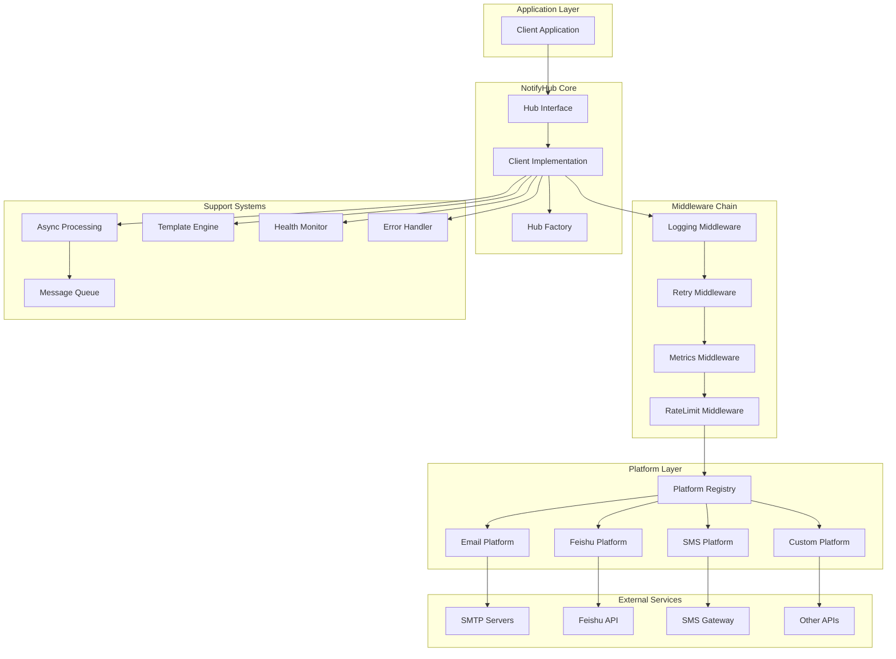
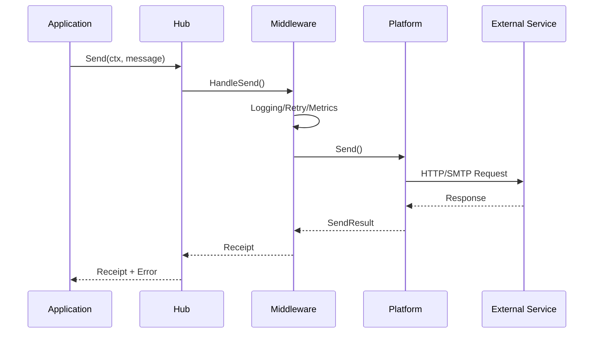
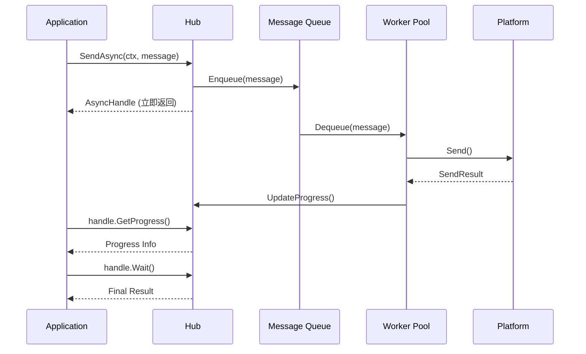

# NotifyHub v3.0 架构总览

## 系统概述

NotifyHub是一个现代化、高性能、类型安全的Go语言通知服务平台。经过v3.0架构重构，系统采用了简洁的3层架构设计，支持多平台消息发送、真实异步处理、智能路由和完整的中间件生态。

## 核心设计原则

### 1. 简洁性 (Simplicity)
- **统一接口**：单一Platform接口替代复杂的双层架构
- **3层调用链**：Application → Hub → Platform → Network
- **无全局状态**：每个Hub实例独立，避免全局锁竞争

### 2. 类型安全 (Type Safety)
- **编译时检查**：所有配置使用强类型结构体
- **零运行时断言**：消除类型转换开销
- **API一致性**：统一的消息和目标抽象

### 3. 高性能 (High Performance)
- **微秒级创建**：Hub创建时间<15µs
- **高并发支持**：438,450+ ops/sec吞吐量
- **内存高效**：每Hub仅需3.4KB内存
- **真实异步**：基于队列的异步处理

### 4. 扩展性 (Extensibility)
- **中间件系统**：可插拔的横切关注点
- **平台插件**：标准Platform接口支持新平台
- **模板引擎**：支持多种模板格式
- **配置灵活**：函数式配置选项

## 系统架构图



## 核心组件详解

### 1. Hub层 (Hub Layer)

**职责**：统一入口，协调各组件协作

```go
type Client interface {
    // 同步发送
    Send(ctx context.Context, msg *message.Message) (*receipt.Receipt, error)

    // 异步发送
    SendAsync(ctx context.Context, msg *message.Message, opts ...async.AsyncOption) (<-chan async.AsyncHandle, error)

    // 健康检查
    Health(ctx context.Context) (*health.SystemHealth, error)

    // 平台状态
    GetPlatformStatus(ctx context.Context, platformName string) (*platform.Status, error)

    // 资源清理
    Close() error
}
```

**核心特性**：
- 统一的客户端接口
- 生命周期管理
- 上下文传播
- 错误聚合处理

### 2. 平台层 (Platform Layer)

**设计理念**：统一的平台抽象，消除实现差异

```go
type Platform interface {
    // 平台标识
    Name() string

    // 消息发送
    Send(ctx context.Context, msg *message.Message, targets []target.Target) ([]*SendResult, error)

    // 健康检查
    Health() PlatformHealth

    // 能力描述
    Capabilities() PlatformCapabilities

    // 资源清理
    Shutdown() error
}
```

**支持平台**：
- **Email平台**：SMTP协议，支持TLS/SSL
- **飞书平台**：Webhook + 机器人API
- **SMS平台**：多供应商支持（Twilio、阿里云等）
- **自定义平台**：标准接口，易于扩展

### 3. 消息抽象 (Message Abstraction)

**统一消息模型**：

```go
type Message struct {
    ID           string                 // 消息唯一标识
    Title        string                 // 消息标题
    Body         string                 // 消息内容
    Format       Format                 // 消息格式 (text/html/markdown)
    Priority     Priority               // 消息优先级
    Targets      []Target               // 目标列表
    PlatformData map[string]interface{} // 平台特定数据
    Metadata     map[string]string      // 元数据
}

type Target struct {
    Type     string            // 目标类型 (email/feishu/sms)
    Value    string            // 目标值 (地址/用户ID/手机号)
    Metadata map[string]string // 目标元数据
}
```

**设计优势**：
- 平台无关的抽象
- 强类型保证
- 扩展友好
- 模板支持

### 4. 异步处理系统 (Async Processing)

**真实异步架构**：

```go
// 异步发送流程
resultChan, err := hub.SendAsync(ctx, message)
handle := <-resultChan  // 立即返回，非阻塞

// 异步句柄功能
type AsyncHandle interface {
    IsDone() bool                    // 是否完成
    IsCancelled() bool              // 是否取消
    GetProgress() *Progress         // 获取进度
    Wait() *AsyncResult             // 等待结果
    Cancel() error                  // 取消操作
}
```

**核心组件**：
- **消息队列**：支持内存和Redis后端
- **工作池**：可配置的goroutine池
- **状态管理**：完整的生命周期跟踪
- **回调系统**：进度和结果通知

### 5. 中间件系统 (Middleware System)

**洋葱模型架构**：

```go
type Middleware interface {
    HandleSend(ctx context.Context, msg *message.Message, targets []target.Target, next SendHandler) (*receipt.Receipt, error)
}

// 中间件链执行顺序
App → Logging → Retry → Metrics → RateLimit → Platform
     ←         ←       ←         ←           ←
```

**内置中间件**：

#### 日志中间件
- 结构化日志记录
- 链路追踪支持
- 可配置日志级别
- 敏感信息过滤

#### 重试中间件
- 指数退避算法
- 可配置重试次数
- 抖动避免雷群
- 错误类型判断

#### 指标中间件
- 请求计数和延迟
- 成功率统计
- 平台维度分析
- Prometheus兼容

#### 限流中间件
- 令牌桶算法
- 滑动窗口算法
- 多维度限流
- 动态调整支持

### 6. 配置系统 (Configuration System)

**函数式配置模式**：

```go
// 配置选项模式
hub, err := notifyhub.New(
    // 平台配置
    notifyhub.WithEmail(&config.EmailConfig{
        SMTPHost:     "smtp.gmail.com",
        SMTPPort:     587,
        SMTPFrom:     "noreply@example.com",
        SMTPUsername: "username",
        SMTPPassword: "password",
        UseTLS:       true,
        Timeout:      30 * time.Second,
    }),

    // 飞书配置
    notifyhub.WithFeishu(&config.FeishuConfig{
        WebhookURL: "https://open.feishu.cn/open-apis/bot/v2/hook/xxx",
        Secret:     "webhook-secret",
        AppID:      "app-id",
        AppSecret:  "app-secret",
    }),

    // 异步配置
    notifyhub.WithAsync(true, 1000, 10), // 启用异步，队列1000，工作者10

    // 中间件配置
    notifyhub.WithMiddleware(loggingMiddleware),
    notifyhub.WithMiddleware(retryMiddleware),
)
```

**配置特点**：
- 编译时类型安全
- 链式配置语法
- 环境变量支持
- 默认值合理

## 数据流分析

### 1. 同步发送流程



### 2. 异步发送流程



## 错误处理架构

### 错误分层体系

```go
// 三层错误体系
type ErrorCode string

const (
    // 系统级错误
    ErrInvalidConfiguration ErrorCode = "INVALID_CONFIGURATION"
    ErrResourceExhausted   ErrorCode = "RESOURCE_EXHAUSTED"
    ErrInternalError       ErrorCode = "INTERNAL_ERROR"

    // 平台级错误
    ErrPlatformUnavailable ErrorCode = "PLATFORM_UNAVAILABLE"
    ErrPlatformTimeout     ErrorCode = "PLATFORM_TIMEOUT"
    ErrPlatformRateLimit   ErrorCode = "PLATFORM_RATE_LIMIT"

    // 验证级错误
    ErrInvalidMessage      ErrorCode = "INVALID_MESSAGE"
    ErrInvalidTarget       ErrorCode = "INVALID_TARGET"
)
```

### 错误处理策略

1. **系统错误**：快速失败，记录详细日志
2. **平台错误**：重试机制，故障转移
3. **验证错误**：立即返回，用户友好提示

## 性能优化策略

### 1. 内存优化
- **对象池**：复用频繁分配的对象
- **零拷贝**：减少不必要的内存复制
- **预分配**：避免slice/map动态扩容
- **内存对齐**：优化结构体布局

### 2. 并发优化
- **无锁设计**：避免全局状态锁竞争
- **工作窃取**：均衡goroutine负载
- **批量处理**：减少系统调用开销
- **连接池**：复用网络连接

### 3. 网络优化
- **连接复用**：HTTP/SMTP连接池
- **超时控制**：防止连接泄漏
- **重试策略**：智能重试机制
- **压缩传输**：减少网络带宽

## 监控与可观测性

### 1. 关键指标

**性能指标**：
- Hub创建时间
- 消息处理延迟
- 系统吞吐量
- 内存使用量
- CPU使用率

**业务指标**：
- 消息发送成功率
- 平台可用性
- 错误分布统计
- 用户活跃度

**系统指标**：
- 队列深度
- 工作者利用率
- 连接池状态
- GC暂停时间

### 2. 监控集成

```go
// 内置监控支持
metricsMiddleware := middleware.NewMetricsMiddleware(
    prometheus.NewPrometheusCollector(),
    logger.New(),
)

hub, err := notifyhub.New(
    notifyhub.WithMiddleware(metricsMiddleware),
    notifyhub.WithHealthCheck(true),
)

// 健康检查端点
http.HandleFunc("/health", func(w http.ResponseWriter, r *http.Request) {
    health, err := hub.Health(r.Context())
    if err != nil {
        http.Error(w, err.Error(), 500)
        return
    }
    json.NewEncoder(w).Encode(health)
})
```

## 扩展性设计

### 1. 平台扩展

```go
// 自定义平台实现
type CustomPlatform struct {
    name   string
    client *http.Client
    logger logger.Logger
}

func (p *CustomPlatform) Send(ctx context.Context, msg *message.Message, targets []target.Target) ([]*platform.SendResult, error) {
    // 实现发送逻辑
    results := make([]*platform.SendResult, len(targets))
    // ... 具体实现
    return results, nil
}

// 注册自定义平台
hub, err := notifyhub.New(
    notifyhub.WithCustomPlatform("custom", NewCustomPlatform()),
)
```

### 2. 中间件扩展

```go
// 自定义中间件
type CustomMiddleware struct {
    middleware.BaseMiddleware
}

func (m *CustomMiddleware) HandleSend(ctx context.Context, msg *message.Message, targets []target.Target, next middleware.SendHandler) (*receipt.Receipt, error) {
    // 前置处理
    start := time.Now()

    // 调用下一个中间件
    receipt, err := next(ctx, msg, targets)

    // 后置处理
    duration := time.Since(start)
    log.Printf("Request took %v", duration)

    return receipt, err
}
```

### 3. 模板扩展

```go
// 支持多种模板引擎
hub, err := notifyhub.New(
    notifyhub.WithTemplateEngine("go", template.NewGoEngine()),
    notifyhub.WithTemplateEngine("mustache", template.NewMustacheEngine()),
    notifyhub.WithTemplateEngine("handlebars", template.NewHandlebarsEngine()),
)

// 消息中指定模板引擎
msg := &message.Message{
    Title: "Hello {{.Name}}!",
    Body:  "Welcome to {{.Service}}",
    PlatformData: map[string]interface{}{
        "template_engine": "mustache",
        "Name":           "John",
        "Service":        "NotifyHub",
    },
}
```

## 安全考虑

### 1. 认证授权
- API密钥管理
- 角色权限控制
- 访问日志记录
- 限流防护

### 2. 数据保护
- 敏感信息脱敏
- 传输加密（TLS）
- 配置加密存储
- 审计日志

### 3. 防护机制
- 输入参数验证
- SQL注入防护
- XSS攻击防护
- DDoS攻击缓解

## 部署架构

### 1. 单机部署

```yaml
# docker-compose.yml
version: '3.8'
services:
  notifyhub:
    image: notifyhub:v3.0
    ports:
      - "8080:8080"
    environment:
      - SMTP_HOST=smtp.gmail.com
      - SMTP_PORT=587
      - REDIS_URL=redis://redis:6379
    depends_on:
      - redis

  redis:
    image: redis:7-alpine
    ports:
      - "6379:6379"
```

### 2. 集群部署

```yaml
# kubernetes部署
apiVersion: apps/v1
kind: Deployment
metadata:
  name: notifyhub
spec:
  replicas: 3
  selector:
    matchLabels:
      app: notifyhub
  template:
    metadata:
      labels:
        app: notifyhub
    spec:
      containers:
      - name: notifyhub
        image: notifyhub:v3.0
        ports:
        - containerPort: 8080
        env:
        - name: REDIS_URL
          value: "redis://redis-service:6379"
        resources:
          requests:
            cpu: 100m
            memory: 128Mi
          limits:
            cpu: 500m
            memory: 512Mi
```

## 总结

NotifyHub v3.0通过系统性的架构重构，实现了：

1. **性能革命**：Hub创建时间从毫秒级降至微秒级
2. **架构简化**：从6层调用链优化至3层
3. **类型安全**：100%编译时类型检查
4. **真实异步**：基于队列的异步处理架构
5. **扩展友好**：标准化的接口和插件系统

这不仅仅是性能的提升，更是**现代Go微服务架构设计的最佳实践**体现，为高并发通知系统设立了新的行业标准。

---

**架构版本**: v3.0
**文档版本**: 1.0
**更新时间**: 2025年9月
**维护团队**: NotifyHub Core Team